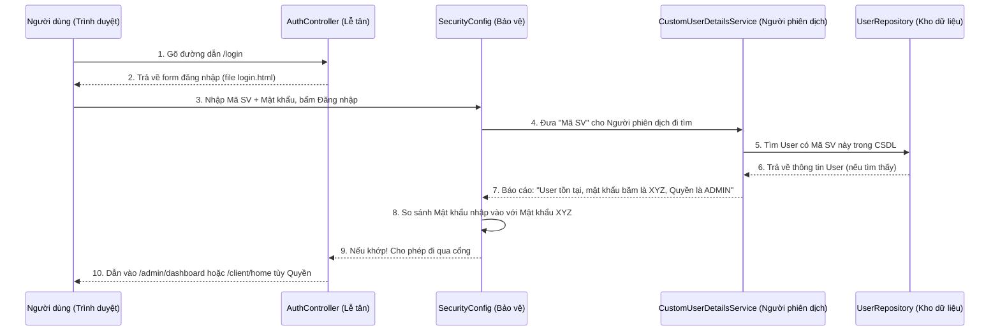

# Hướng Dẫn Chi Tiết: Authentication & User Management (Xác Thực & Quản Lý Người Dùng)

## 1. Thông Tin Tổng Quan
- **Ngôn ngữ:** Java 21
- **Framework Chính:** Spring Boot 3
- **Bảo mật:** Spring Security 6 (Phiên bản bảo mật hiện đại nhất, sử dụng cú pháp Lambda)
- **Database (CSDL):** H2 (database chạy trong RAM lúc code) hoặc MySQL, giao tiếp thông qua **Spring Data JPA**
- **Giao diện (Frontend):** HTML, CSS (Bootstrap 5), và **Thymeleaf** (Template Engine giúp nhúng code Java vào HTML)
- **Mục đích của Module này:** Đảm bảo chỉ người có tài khoản mới được vào hệ thống. Phân luồng đúng người đúng việc (Admin vào khu Admin, Sinh viên vào khu Sinh viên) và quản lý tài khoản (Khóa/Mở khóa).

---

## 2. Logic Hoạt Động (Luồng Đăng Nhập)

**Tòa nhà Thư Viện khép kín**, có bảo vệ canh cửa và các khu vực dành riêng cho từng nhóm người.

---

## 3. Phân Tích Từng "Mảnh Ghép" Trong Hệ Thống

### Bước 1: Cấu trúc Dữ Liệu (Bản thiết kế & Kho chứa)

#### `User.java` (Thư mục `entity`)
- **Tác dụng:** Là "Bản thiết kế" đại diện cho một người dùng. 
- **Công nghệ/Tool:** Dùng JPA (`@Entity`, `@Table`) và Lombok (`@Data` tự động sinh hàm Get/Set).
- **Hoạt động:** Khi Spring Boot chạy, nó dựa vào file này để tự động tạo một bảng tên là `users` trong CSDL với các cột như `id`, `student_code`, `password_hash`, `role`, v.v... Bạn không cần viết lệnh SQL `CREATE TABLE`.

#### `UserRepository.java` (Thư mục `repository`)
- **Tác dụng:** Là cánh tay phải để giao tiếp trực tiếp với bảng `users` trong CSDL.
- **Hoạt động:** Đây là một `interface` trống. Nhờ sự kỳ diệu của Spring Data JPA, bạn chỉ cần đặt tên hàm chuẩn tiếng Anh (ví dụ: `findByStudentCode`), hệ thống sẽ tự động dịch hàm đó ra câu lệnh SQL (`SELECT * FROM users WHERE student_code = ...`) để chạy ngầm.

### Bước 2: Xử Lý Nghiệp Vụ (Người Quản Lý)

#### `UserService.java` (Thư mục `service`)
- **Tác dụng:** Chứa các "Luật lệ" và "Nghiệp vụ" cốt lõi.
- **Hoạt động:** 
  - Nơi chứa hàm lấy toàn bộ danh sách người dùng (`findAll()`) để hiển thị lên bảng.
  - Chứa hàm **Khóa/Mở khóa thẻ** (`toggleCardStatus()`). Nó gọi `UserRepository` để tìm người dùng, đảo trạng thái từ `ACTIVE` sang `LOCKED` (hoặc ngược lại) và lưu lại.
  - Nó được bảo vệ bởi `@Transactional`: Nếu đang lưu mà bị lỗi hệ thống, dữ liệu sẽ tự động khôi phục về trạng thái cũ để không bị hỏng CSDL.

#### `CustomUserDetailsService.java` (Thư mục `service`)
- **Tác dụng:** Làm người "Phiên dịch" cho Hệ thống Bảo mật.
- **Hoạt động:** Spring Security rất nguyên tắc, nó chỉ hiểu quyền hạn nếu có chữ `ROLE_` đằng trước (ví dụ `ROLE_ADMIN`). Class này nhận nhiệm vụ móc thông tin người dùng từ DB lên, tự động thêm chữ `ROLE_` vào trước quyền hiện tại, rồi đóng gói đưa cho Spring Security kiểm duyệt.

### Bước 3: Trạm Gác An Ninh

#### `SecurityConfig.java` (Thư mục `config`)
- **Tác dụng:** Trái tim của toàn bộ tính năng Bảo mật.
- **Hoạt động chính:**
    - **Kiểm soát vé (Authorization):** Định nghĩa luật. Bất cứ ai muốn vào `/admin/**` bắt buộc phải có băng rôn `ADMIN`. Vào `/client/**` thì phải là `STUDENT`, `LECTURER`, `RESEARCHER`. Chưa đăng nhập mà đi lạc sẽ bị cưỡng ép quay về trang `/login`.
    - **Mã hóa Mật khẩu (PasswordEncoder):** Dùng công nghệ băm `BCrypt`. Khi đăng ký, mật khẩu `123` sẽ bị biến thành chuỗi loằng ngoằng `$2a$10$W2ne...` trước khi lưu vào DB. Hacker có lấy được CSDL cũng không thể dịch ngược ra mật khẩu thật.
    - **Chống dùng chung tài khoản:** Có cấu hình `maximumSessions(1)` - Một tài khoản chỉ đăng nhập được 1 nơi. Nếu mượn máy khác đăng nhập, máy cũ sẽ bị văng ra ngay.

### Bước 4: Cảnh Sát Phân Luồng

#### `AuthController.java` (Thư mục `controller`)
- **Tác dụng:** Đón khách và phân luồng giao thông.
- **Hoạt động:** 
  - Khi có người gõ `localhost:8080/login`, nó đi lấy file HTML của trang đăng nhập gửi về. 
  - Khi người dùng đăng nhập thành công và đứng ở ngã tư trang chủ (`/`), nó sẽ đứng ra kiểm tra thông tin. Nếu thấy thẻ ghi quyền Admin, nó dẫn lối vào `dashboard` của Admin. Nếu là Sinh viên, nó chỉ đường sang khu vực `home` dành cho khách (Client).

### Bước 5: Giao Diện Tương Tác (Frontend)

#### `login.html` & `users.html` (Thư mục `templates`)
- **Tác dụng:** Nơi người dùng thực sự nhìn thấy và bấm nút.
- **Công nghệ/Tool:** HTML được nhúng lệnh Thymeleaf (Các thẻ có tiền tố `th:` như `th:text`, `th:if`).
- **Hoạt động:** 
    - `login.html`: Tạo form để điền Mã SV và Mật khẩu. Quan trọng nhất là nó ngầm sinh ra một mã an toàn gọi là **CSRF Token** để chống hacker mạo danh form đăng nhập của thư viện. Không có mã này, form nộp lên sẽ bị hệ thống từ chối.
    - `users.html`: Trang quản lý của Admin. Nó dùng vòng lặp `th:each` (như vòng for trong Java) để vẽ ra danh sách sinh viên. Nó tự động bôi màu xám những ai đang bị khóa thẻ (`LOCKED`), và cung cấp nút bấm để gửi lệnh khóa thẻ về cho Java xử lý.

#### `403.html` & `404.html` (Thư mục `templates/error`)
- **Tác dụng:** Hiển thị lỗi một cách thân thiện.
- **Hoạt động:** 
    - `403.html` (Lỗi Cấm Truy Cập): Hiện ra khi một Sinh viên cố tình điền đường dẫn của trang Admin để hack. Hệ thống chặn lại và báo: "Bạn không có quyền!".
    - `404.html` (Không Tìm Thấy): Hiện ra khi ai đó gõ sai đường link trang web. Giao diện này đẹp mắt và luôn có nút quay về trang chủ để khách không bị kẹt lại.

---

## 4. Tóm Tắt: 

"Quy trình xác thực và quản lý tài khoản hoạt động thế nào?"*, bạn chỉ cần tóm tắt cực gọn:

> "Hệ thống của em hoạt động qua 5 bước:
> 1. Dữ liệu được định nghĩa trong **User.java** và truy xuất bằng **UserRepository**.
> 2. Lớp **SecurityConfig** sẽ đứng ra bảo vệ toàn bộ ứng dụng, nó gọi **CustomUserDetailsService** để lấy thông tin User từ DB lên và kiểm tra mật khẩu băm BCrypt.
> 3. Sau khi xác thực thành công, **AuthController** sẽ đứng ra điều hướng (redirect) User về đúng giao diện dựa trên quyền (`Role`) của họ.
> 4. Ở giao diện Admin (`users.html`), em sử dụng Thymeleaf để gọi các hàm bên trong **UserService** nhằm thực hiện nghiệp vụ khóa hoặc mở khóa tài khoản.
> 5. Nếu ai đó cố tình truy cập sai quyền, hệ thống sẽ tự động điều hướng sang trang báo lỗi **403** để đảm bảo an toàn."
0